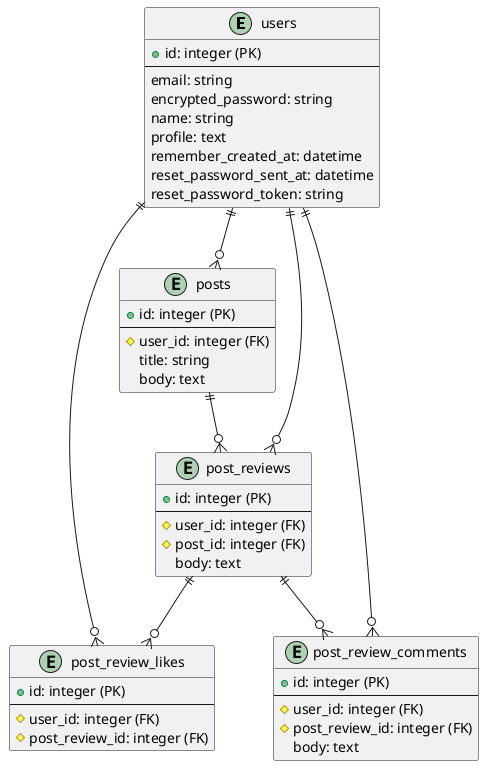

# README

## Version
* Ruby  2.7.1
* Rails 6.0.3.3

## ER図

```plantuml
@startuml

skinparam {
  defaultFontName Menlo
  backgroundColor #FFFFFE
}

entity users {
  + id: integer (PK)
  --
  email: string
  encrypted_password: string
  name: string
  profile: text
  remember_created_at: datetime
  reset_password_sent_at: datetime
  reset_password_token: string
}

entity posts {
  + id: integer (PK)
  --
  # user_id: integer (FK)
  title: string
  body: text
}

entity post_reviews {
  + id: integer (PK)
  --
  # user_id: integer (FK)
  # post_id: integer (FK)
  body: text
}

entity post_review_likes {
  + id: integer (PK)
  --
  # user_id: integer (FK)
  # post_review_id: integer (FK)
}

entity post_review_comments {
  + id: integer (PK)
  --
  # user_id: integer (FK)
  # post_review_id: integer (FK)
  body: text
}

users ||--o{ post_reviews
users ||--o{ posts
users ||--o{ post_review_likes
users ||--o{ post_review_comments

posts ||--o{ post_reviews
post_reviews ||--o{ post_review_likes
post_reviews ||--o{ post_review_comments

@enduml
```